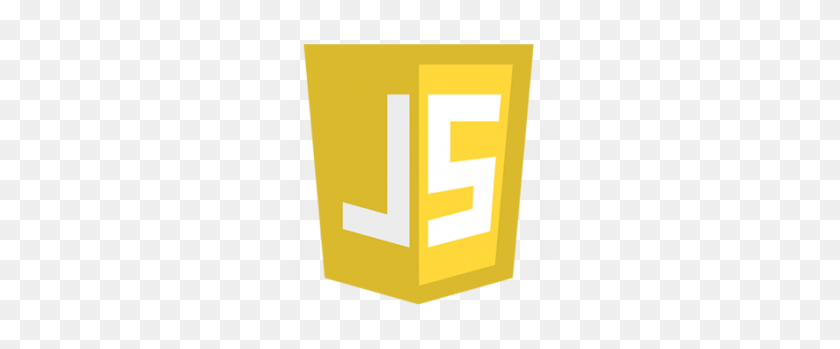
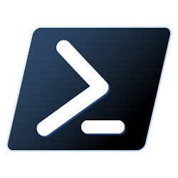
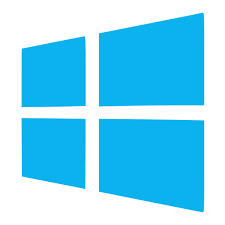

# Rick's Repository

**Hi!!👋👋 Thank you for looking at my work.**

This will be a collection of follow alongs and projects that I (Rick) have done I will source where I got the ideas, books, authors and other code
for every project in this file.

### A list of languages and soft skills for future employment.✨

In this list further down in this document I will explain how knowledgeable I am in each one.

* Python
    * Some Django 
    * Pygame 
    * tkinter 
* HTML5 
* CSS 
* Javascript 
* Github 
* Markdown (Kind of a given with html 😆) 
* Powershell 
* Debian 
* Windows from xp til 10 
* Excel, Google Sheets, Libre Office   
* Dealing with my sons 😆😆😆
